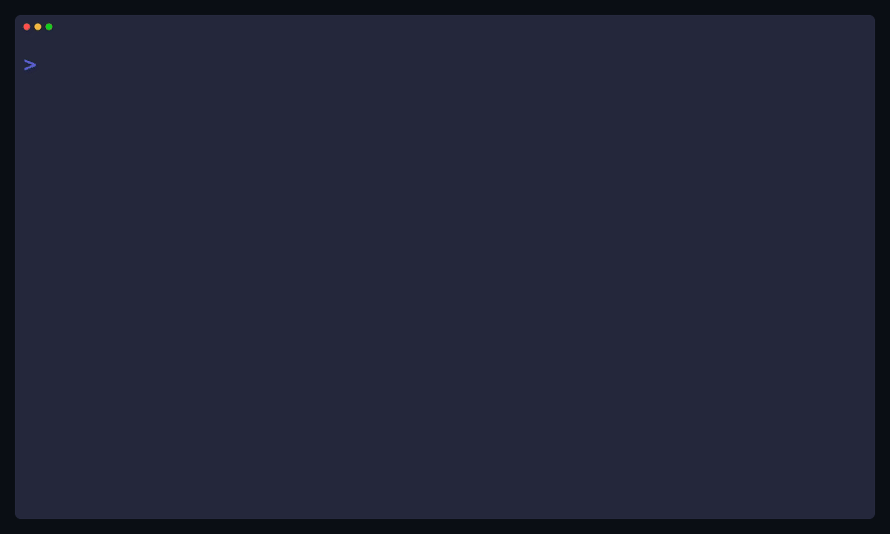

# AI Agent CLI

A polished Gemini-powered agent that plans tool calls, executes them, and iterates until it has a final answer. Built for clean, premium terminal output with a persistent memory layer.

## Demo



## Highlights

- Multi-step tool loop (plan → call tools → observe → answer).
- Rich terminal UI (panels, tables, syntax highlighting, spinners).
- Persistent memory (`.agent_memory.txt`) for continuity across sessions.
- Extensible toolset: file IO, Python execution, directory ops.
- Verbose mode for debugging tokens and tool calls.
- Scoped execution for safety.

## Quickstart

1) Install dependencies:
```bash
uv sync
```

2) Set your API key:
```bash
echo 'GEMINI_API_KEY=your_key_here' > .env
```

3) Run:
```bash
uv run main.py "read main.py"
```

Start a chat session:
```bash
uv run main.py --chat
```

## CLI Usage

```bash
uv run main.py "list files in the root"
uv run main.py --chat
uv run main.py "read prompts.py" --verbose
uv run main.py "..." --no-memory
uv run main.py --reset-memory
uv run main.py --memory-file /tmp/agent_memory.txt
```

## Tools Available

- `get_files_info(directory)` — list files and sizes.
- `get_file_content(file_path)` — read file contents (auto-truncated).
- `write_file(file_path, content)` — write/overwrite a file.
- `run_python_file(file_path, args)` — execute a Python file with optional args.
- `mkdir(directory_path)` — create a directory.
- `rmdir(directory_path)` — remove a directory.

## How It Works

The agent loops through:
1) Model decides which tool(s) to call.
2) The program executes tools and collects results.
3) Results are fed back into the conversation.
4) The model returns a final response when ready.

After each completed turn, a short memory summary is stored and injected into the next session’s system prompt.

## Safety & Configuration

Tool calls are scoped to a working directory defined in `call_function.py` (`working_directory` is set to `.` by default). Change this if you want to restrict access (for example, `./calculator`).

Be cautious when running the agent with write or execute permissions; it can modify or run code on your machine.

## Recording a Demo

```bash
brew install vhs
./scripts/record-demo.sh
```

Edit `docs/demo.tape` to change the flow, theme, or prompts.

---

Built while following the Boot.dev course, then extended with a polished UI and memory features.
